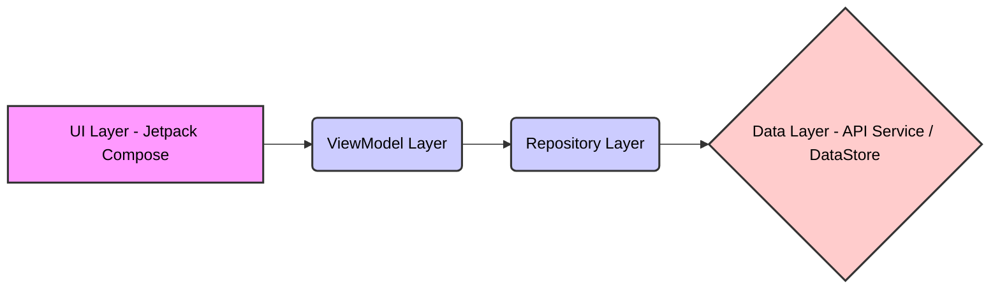

# SimpleNote - Android App

SimpleNote is a note-taking Android application built with Kotlin and Jetpack Compose. It provides a simple and intuitive interface for creating, editing, and managing your notes. It also has authentication and user profile features.

## Features

*   **Authentication**: User registration and login with secure token management.
*   **Note Management**: Create, read, update, and delete notes.
*   **Search & Filter**: Search notes by title or description.
*   **User Profile**: User profile management with options to change password and toggle dark mode.
*   **Onboarding**: A guided onboarding experience for new users.
*   **Theming**: Dynamic dark/light theme support.
*   **Offline Support:** Utilizes DataStore for local data persistence

## Screenshots

<!-- Add screenshots of your application here -->

*Placeholder for Screenshots*

## Tech Stack

*   **Kotlin**: Primary programming language.
*   **Jetpack Compose**: Modern UI toolkit for building native Android UI.
*   **Hilt**: Dependency Injection for Android.
*   **Retrofit**:  Type-safe HTTP client for Android and Java.
*   **OkHttp**: HTTP client library.
*   **Coroutines**: For asynchronous programming.
*   **Navigation Compose**: For handling in-app navigation.
*   **DataStore**: Jetpack library for data storage.
*   **Compose Icons**: For using vector icons in compose.
*   **Material 3**: For using Material Design 3 components.

## Architecture

SimpleNote follows a clean architecture, separating concerns into distinct layers:

*   **UI Layer (Jetpack Compose)**:  Composables define the user interface and handle user interactions. UI components observe `StateFlow` from `ViewModel`s to react to data changes.
*   **ViewModel Layer**: `ViewModel`s are responsible for preparing and managing data for the UI.  They interact with the `Repository` layer and expose data as `StateFlow`.  `ViewModel`s use `viewModelScope` to launch coroutines.
*   **Repository Layer**:  The `Repository` layer acts as a single source of truth for data. It abstracts data sources such as network API calls (`ApiService`) and local data storage (`DataStore`). Repositories use Kotlin Flows to emit data to the `ViewModel` layer.
*   **Data Layer**: This layer includes local data storage using `DataStore` and remote API calls using `Retrofit`. `TokenManager` manages access and refresh tokens securely. `ApiClient` provides a singleton instance of `ApiService`.
*   **API Layer**: This layer has `ApiService` which defines the REST API endpoints using Retrofit annotations. `ApiClient` builds the Retrofit instance and provides the `ApiService`. `TokenAuthenticator` handles token refresh when access tokens expire.



## Getting Started

These instructions will get you a copy of the project up and running on your local machine for development and testing purposes.

### Prerequisites

*   Android Studio installed
*   Basic knowledge of Kotlin and Android development

### Installation

1.  Clone the repository:

    ```bash
    git clone https://github.com/mhdsdt/simple-note
    ```

2.  Open the project in Android Studio.
3.  Build the project: `Build` -> `Make Project`.
4.  Run the application on an emulator or physical device.

## Configuration

No specific configuration is required. The app uses a base URL defined in `ApiClient.kt`:

```kotlin
private val baseUrl = "https://simple-note.liara.run/"
```

You can change this URL to point to your own backend if needed.

## License

This project is licensed under the MIT License - see the [LICENSE](LICENSE) file for details.
